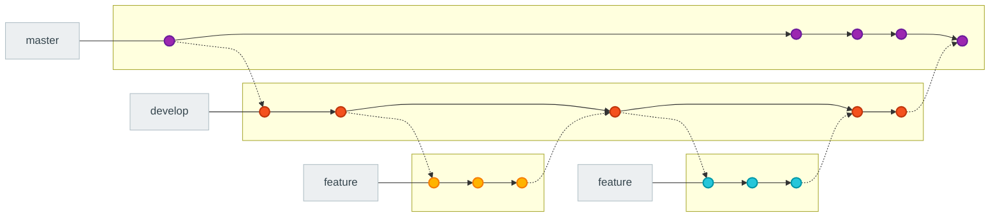
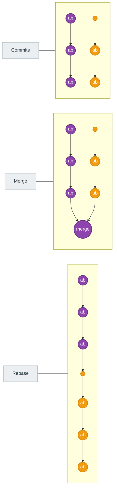
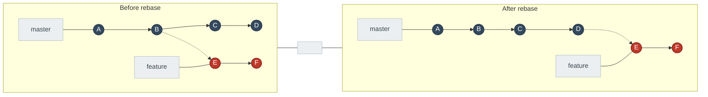

# GitHub Guide for Solo Developers

GitHub can feel like a maze when you are on your own: repos, issues, branches, pull requests, actions, releases. This guide turns that maze into a well-lit path. It mixes short reference bites with do-along steps so you can ship without second-guessing your workflow.

Think of this as your “operating manual” for a solo project. You will learn how to plan work with issues, keep branches tidy, write PRs that are easy to review (even if you are the reviewer), and ship with confidence using tags and automation. Each section is written to be skimmed quickly and then used verbatim when you are at the keyboard.

Bookmark it, and reuse the commands and checklists whenever you start a new task. The more you repeat the steps, the more automatic your GitHub flow becomes.

---

## Table of contents
- [Mindset and setup](#mindset-and-setup)
- [Create a new repository](#create-a-new-repository)
- [Daily workflow (do-along)](#daily-workflow-do-along)
- [Issues: tracking work](#issues-tracking-work)
- [Branches and naming](#branches-and-naming)
- [Pull requests: clean reviews and merges](#pull-requests-clean-reviews-and-merges)
- [Releases and tags](#releases-and-tags)
- [Automation with GitHub Actions](#automation-with-github-actions)
- [Security basics](#security-basics)
- [Housekeeping and hygiene](#housekeeping-and-hygiene)
- [Common commands reference](#common-commands-reference)
- [Further reading](#further-reading)

---

## Mindset and setup
Start with habits that keep you fast and safe: keep `main` shippable, branch for every change, automate what you can, and make sure Git knows who you are. These are the guardrails that prevent slowdowns later.
- Keep `main` always releasable; branch for any change.
- Prefer small, frequent pull requests over large drops.
- Automate tests and linting in CI; run locally before pushing.
- Configure your identity once: `git config --global user.name "Your Name"` and `git config --global user.email "you@example.com"`.

---

## Create a new repository
Use this when you are spinning up something new. Create the repo, clone it, verify remotes, and make a first commit so your history starts clean and intentional.
1) Create on GitHub: New repo → choose name, description, license, `.gitignore` (pick your language), add README.
2) Clone locally:
```bash
git clone https://github.com/OWNER/REPO.git
cd REPO
```
3) Verify remotes:
```bash
git remote -v
```
4) Create a first commit if needed:
```bash
git status
git add .
git commit -m "chore: initial commit"
git push -u origin main
```

---

## Daily workflow (do-along)
Use this at the start of a day or task. It keeps your branch current, your commits small, your PRs ready, and your cleanup automatic.

1) Sync main and dependencies
```bash
git switch main
git pull --ff-only
```
2) Create a focused branch
```bash
git switch -c feature/short-task-name
```
3) Code, commit in small steps
```bash
git status
git add path/to/file
git commit -m "feat: add X"   # or chore/fix/docs/test
```
4) Push and publish branch
```bash
git push -u origin feature/short-task-name
```
5) Open PR (via GitHub UI or CLI)
```bash
gh pr create --fill   # GitHub CLI; or use the web form
```
6) Run checks locally before merge
```bash
npm test && npm run lint   # adjust to your stack
```
7) Merge when green (see PR section), then clean up branch
```bash
git switch main
git pull --ff-only
git branch -d feature/short-task-name
git push origin --delete feature/short-task-name
```

---

## Issues: tracking work
Issues are your lightweight project manager. They capture intent before code exists, and they keep future-you honest about why a change happened. Treat them as the conversation starter and record of decisions: when someone asks “why did we do this?” you point to the issue. An issue is a single ticket that describes work to be done (feature, bug, question, chore) and acts as the source of truth for context, decisions, and acceptance criteria. No code changes live here—only discussion and state.

**When to open an issue:** new feature, bug, question, chore, or decision to document.

**Best practices**
- One problem per issue; avoid mixed scopes.
- Describe the user impact first; add context, expected vs. actual, and acceptance criteria.
- Use labels for type and priority; assign an owner; link to PRs that implement it.

**Quick issue template (copy/paste)**
```
## Summary
What needs to change and why.

## Acceptance criteria
- [ ] Outcome 1
- [ ] Outcome 2

## Notes
Links, decisions, screenshots.
```

---

## Branches and naming
Branches are snapshots of the code with their own timeline, letting you build or experiment without touching `main`. Create a branch, switch to it, and work safely; commits here stay isolated until you merge. This keeps stable code clean while you iterate on features or experiments. Good names make history readable. Prefix for intent, keep it short, and stay in sync with `main` so merges are painless.
- Prefix by intent: `feature/`, `fix/`, `chore/`, `docs/`, `spike/`.
- Keep names short and descriptive: `feature/auth-magic-links`.
- Sync main before branching to avoid conflicts: `git switch main && git pull --ff-only`.
- Default: one issue → one branch → one PR.

**Common actions**
```bash
git branch                            # List branches (* marks current)
git branch new-branch                 # Create a branch
git branch -m old new                 # Rename a branch
git switch new-branch                 # Move to a branch (or: git checkout new-branch)
git push -u origin new-branch         # Publish branch to remote
git switch main
git merge new-branch                  # Merge specified branch into current branch
git branch -d new-branch              # Delete local branch when done
git push origin --delete new-branch   # Delete remote branch
```

**Settling conflicts (after a merge reports conflicts)**
1) Open the flagged files and choose what to keep.
2) Stage the resolutions: `git add .`
3) Commit the merge: `git commit -m "Resolve conflicts"`

**Branching flow (visual)**

This matches the preferred style: master (purple) stays steady, develop (orange) carries ongoing work, and feature lanes (yellow/teal) branch off and merge back left-to-right.

---

### Merge vs. rebase (visual)

**How to read this**
- Commits: master (red) and feature (orange) progress independently; histories diverge.
- Merge: histories keep their own timelines and join with a merge commit; feature history stays as-is.
- Rebase: feature history is replayed on top of master, creating a linear history (no merge bubble).

### Before vs. after rebase (side by side)

**What changes in a rebase?** The feature commits (E, F) move to sit on top of the latest master commits, making history linear and removing the merge bubble.

## Pull requests: clean reviews and merges
Pull requests are where your work meets scrutiny—even if you are reviewing yourself. A good PR makes the change obvious, the risk visible, and the rollback clear. Think of it as a narrated tour of the diff: here’s what changed, why it’s safe, and how we know it works. A pull request is simply a request to merge one branch into another (usually feature → main) and serves as the review and safety gate: discussion, checks (tests/lint), approvals, and merge strategy.

**Best practices**
- Scope: one issue/feature per PR; keep it small (< ~300 changed lines) for fast review.
- Title: `[type]: summary` (e.g., `feat: add search filters`).
- Description: what/why, how tested, risks/rollback, links to issues/design.
- Tests: show commands or screenshots; ensure CI passes before merging.
- History: prefer squash merge for tidy history; keep branch up to date with main.

**Do-along: open and merge a PR (solo workflow)**
1) Create branch and commit (from the daily workflow).
2) Push branch: `git push -u origin feature/...`.
3) Open PR:
```bash
gh pr create --title "feat: clear wording" --body "Why/what/how tested" --base main --head feature/clear-wording
```
  Or use GitHub UI: Compare & pull request → fill template.
4) Self-review: read the diff, add comments, ensure tests run.
5) Merge strategy: prefer **Squash and merge** for tidy history; ensure branch is current with main.
6) After merge: delete branch locally/remotely (commands in daily workflow).

**Keep history clean**
- Rebase small PRs to catch up: `git pull --rebase origin main` while on your branch.
- Avoid force pushes to shared branches; for solo work, force push is acceptable after rebase.

---

## Releases and tags
Releases and tags are your milestones. Tags mark a commit in time; Releases add human-friendly notes and artifacts so you (and users) know what shipped when.
- Tag important milestones: `git tag v1.2.0 && git push origin v1.2.0`.
- Use GitHub Releases to attach notes, binaries, and changelogs.
- Keep a `CHANGELOG.md` with sections: Added/Changed/Fixed/Removed.
- For semantic versioning: `MAJOR` (breaking), `MINOR` (features), `PATCH` (fixes).

---

## Automation with GitHub Actions
CI is your tireless reviewer: it runs tests, lint, and builds so you catch issues before merge. Start simple, keep it fast, and require checks on `main`.
**Starter workflow (Node example)**
```yaml
name: ci
on: [pull_request, push]
jobs:
  test:
    runs-on: ubuntu-latest
    steps:
      - uses: actions/checkout@v4
      - uses: actions/setup-node@v4
        with: { node-version: 20 }
      - run: npm ci
      - run: npm test
      - run: npm run lint
```

**Tips**
- Keep workflows fast (< 10 minutes); cache dependencies.
- Protect `main` with required checks before merge.
- Use environments for staging/production deployments.

---

## Security basics
Small habits here prevent big headaches: keep secrets out of git, turn on alerts, and sign what matters. Treat security as part of shipping, not an afterthought.
- Use a `.gitignore` to avoid committing secrets and build artifacts.
- Never commit `.env` with secrets; use GitHub Actions secrets or environment variables.
- Enable Dependabot alerts and updates (Settings → Code security and analysis).
- Sign commits if required: `git config --global commit.gpgsign true` and add your key.

---

## Housekeeping and hygiene
Tidy repos are faster to work in. Remove stale branches, keep your working tree clean, and sync with `main` often to avoid surprise conflicts.
- Remove merged branches regularly.
- Run `git status` often; keep working tree clean.
- Rebase or merge main frequently on long-lived branches to reduce conflicts.
- Back up with tags and Releases for important milestones.

---

## Common commands reference
This is the grab-and-go section: copy/paste when you need the exact incantation without thinking.
```bash
# Sync main
git switch main
git pull --ff-only

# New branch
git switch -c feature/thing

# Stage and commit
git status
git add file
git commit -m "feat: do thing"

# Push and track
git push -u origin feature/thing

# Update branch with main
git switch feature/thing
git pull --rebase origin main

# Tag and push
git tag v1.0.0
git push origin v1.0.0

# Delete branch
git branch -d feature/thing
git push origin --delete feature/thing
```

---

## Further reading
- [GitHub Flow](https://docs.github.com/en/get-started/quickstart/github-flow)
- [GitHub CLI](https://cli.github.com/manual/)
- [Protected branches](https://docs.github.com/repositories/configuring-branches-and-merges-in-your-repository/managing-protected-branches)
- [Actions docs](https://docs.github.com/actions)
- [Semantic versioning](https://semver.org/)

