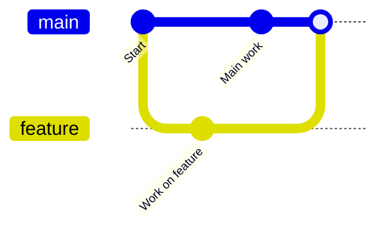
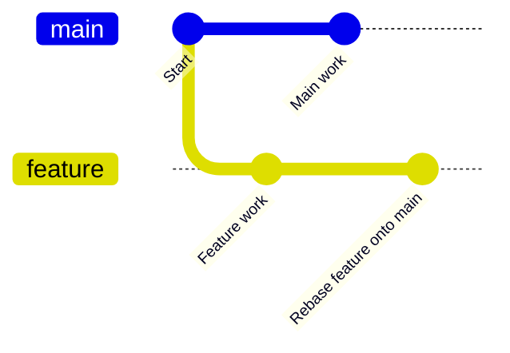

# Git Branches: A Practical Guide

This guide teaches you how to create, use, and manage branches in Git for effective version control and collaboration.

---

## What is a Branch?
A branch is an independent line of development in your project. The default branch is usually called `main` or `master`. Branches let you work on features, fixes, or experiments without affecting the main codebase.

---

## Creating a Branch

Create a new branch:
```bash
git branch feature/my-new-feature
```
Or create and switch in one step:
```bash
git checkout -b feature/my-new-feature
```

---

## Listing Branches

List local branches:
```bash
git branch
```
List remote branches:
```bash
git branch -r
```
List all branches:
```bash
git branch -a
```

---

## Switching Branches

Switch to an existing branch:
```bash
git checkout feature/my-new-feature
```
Or with newer Git:
```bash
git switch feature/my-new-feature
```

---

## Merging Branches

Merge changes from one branch into another (usually into `main`):
```bash
git checkout main
git merge feature/my-new-feature
```

---

## Deleting Branches

Delete a local branch:
```bash
git branch -d feature/my-new-feature      # Safe delete (if merged)
git branch -D feature/my-new-feature      # Force delete (even if not merged)
```
Delete a remote branch:
```bash
git push origin --delete feature/my-new-feature
```

---

## Pushing a Branch to GitHub

Push your branch to the remote repository:
```bash
git push origin feature/my-new-feature
```

---

## Pulling Remote Branches

Fetch all branches:
```bash
git fetch
```
Switch to a remote branch:
```bash
git checkout origin/feature/my-new-feature
```

---

## Practical Tips
- Use descriptive branch names (`feature/`, `bugfix/`, `docs/`, etc.)
- Always pull latest changes before merging
- Delete branches after merging to keep your repo clean
- Use branches for each new feature, bugfix, or experiment

---

## Visual Example

```
* main
  |\
  | * feature/my-new-feature
  |/
* main (after merge)
```

---

## Visualizing Git Branch Actions

Below are diagrams using markdown code blocks to illustrate common git branch actions:

---

### 1. Creating and Merging a Feature Branch



---

### 2. Deleting a Branch After Merge


---

### 3. Multiple Feature Branches and Merges


---

### 4. Rebasing a Feature Branch



---

> **Note:** These diagrams use [Mermaid](https://mermaid-js.github.io/mermaid/#/) syntax, which is supported in GitHub markdown files and many markdown editors. If you view this file on GitHub, the diagrams may not render natively, but you can use a Mermaid-enabled editor or VS Code extension for visualization.

---

## Further Reading
- [Git Branching Documentation](https://git-scm.com/book/en/v2/Git-Branching-Branches-in-a-Nutshell)
- [GitHub Flow](https://docs.github.com/en/get-started/quickstart/github-flow)
- [Atlassian Git Branching Guide](https://www.atlassian.com/git/tutorials/using-branches)

